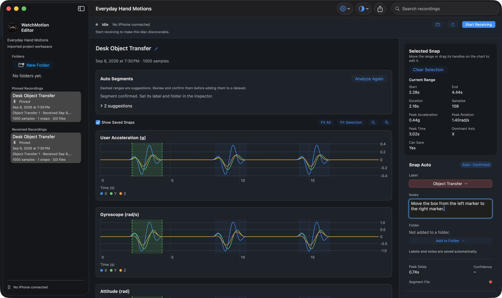
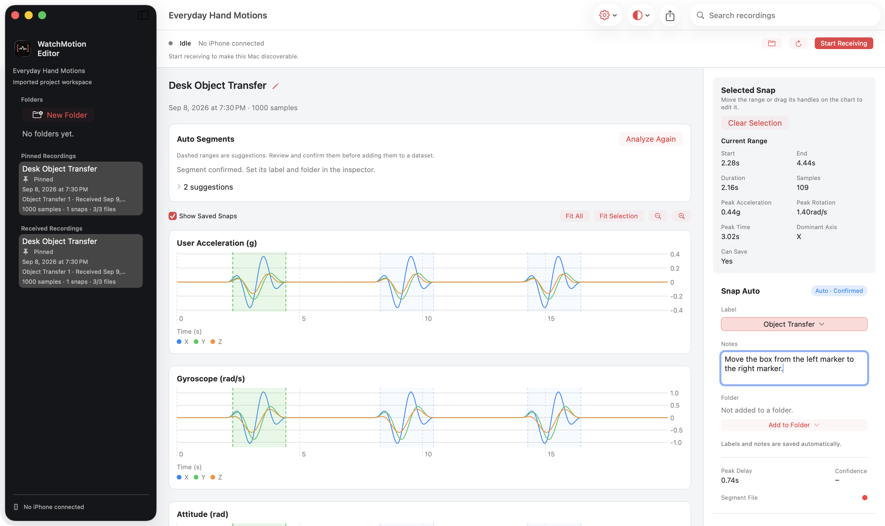
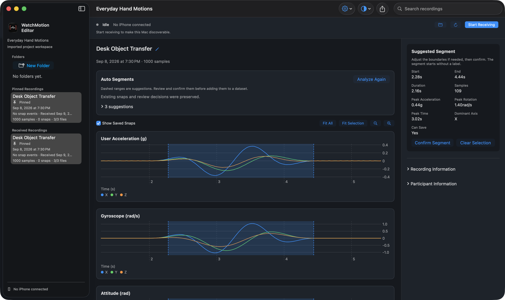

# WatchMotion Editor


The English product website and user guide for **WatchMotion Editor** — capture motion on Apple Watch, review on iPhone, and build labeled datasets on Mac.

## Screenshots

Actual Mac app captures used on the site. The example project uses **illustrative synthetic data**, not a real participant’s recording. Click an image to view it at full size.

| Dark appearance | Light appearance |
| --- | --- |
| [](public/images/mac-editor-dark.png) | [](public/images/mac-editor-light.png) |

<details>
<summary>Auto Segments: reviewing a suggested range</summary>



</details>

The app UI is captured as-is; only the surrounding website backdrop is generated artwork.

## Pages

- **Home** — product introduction and the three-device workflow.
- **Mac Editor** — features illustrated with actual app screens.
- **User Guide** — five chapters, from setup to export, with a [downloadable example project](public/examples/everyday-hand-motions.watchmotion).
- **Support & Privacy** — troubleshooting, contact, and data handling.

## Development

Requires **Node.js 24** and npm.

```sh
npm ci
npm run dev -- --port 3017
```

Open [localhost:3017](http://localhost:3017). Check changes with:

```sh
npm test
npm run build
npm run typecheck
node scripts/smoke-test.mjs # requires the local server
```

Guide content: [`lib/guides.ts`](lib/guides.ts) · Contact and settings: [`lib/site.ts`](lib/site.ts)

## Deploy to Vercel

Import this repository using the **Next.js** preset, **Node.js 24.x**, and production branch **main**. Use `npm ci`, `npm run build`, and the default output directory setting.

Configure the values in [`.env.example`](.env.example), then redeploy:

| Variable | Value |
| --- | --- |
| `SITE_URL` | Verified HTTPS production origin, without a path |
| `APP_STORE_IOS_URL` | Public iPhone / companion Watch listing; leave blank until released |
| `APP_STORE_MAC_URL` | Public Mac listing; leave blank until released |

No Vercel deployment has been performed yet. Before publishing, review the privacy policy against actual operating practices and check the site in desktop/mobile browsers. Missing store links show a coming-soon message; preview builds and an unset `SITE_URL` disable indexing.

## Contact

**우상영** · [sangyoung2730@naver.com](mailto:sangyoung2730@naver.com)
